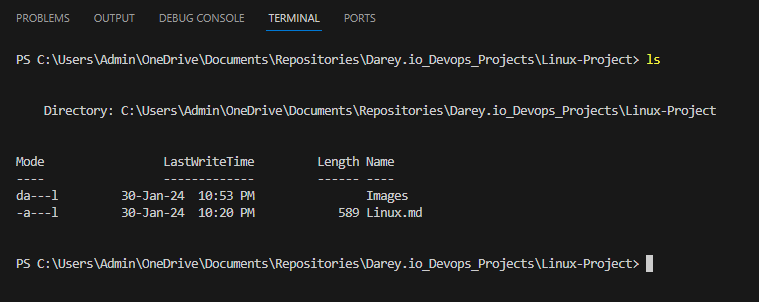

# What is Linux?

**Linux** is the best-known and most-used open source operating system. Popular distributions include Ubuntu, Fedora, Debian, openSUSE, and Red Hat.

Most Linux distributions use **graphical user interface (GUI)**, making them beginner-friendly. However, it is recommended to use the **command line interface (CLI)** because it's quicker and offers more control.

# Basic Commands in Linux

**Linux commands** are a type of Unix command or shell procedure. They run on the **command line interface (CLI)** and interact with your system via texts and processes.

Linux commands are used to perform a variety of tasks, including displaying information about files and directories.

## `sudo` command

**sudo** which is short for **superuser do** is a command that lets you perform tasks that require administrative permissions.

For example **sudo apt upgrade** is used to install and download all the latest package information available for the packages currently installed on the system.

## `pwd` command

**pwd** stands for **print working directory**

It writes to standard output the full path name of your current directory.

## `cd` command

**cd** stands for **change directory** and is used to change the current working directory.

**cd ..** moves one directory up

## `ls` command

**ls** lists directory contents of files and directories. 

**ls -S** sorts files and directories by their sizes, listing the largest ones first.

## `cat` command

**cat** is short for **Concatenate** and is used to list, combine and write file content to the standard output.

## `cp` command

## `mv` command

## `mkdir` command

## `rmdir` command

## `rm` command

## `touch` command

## `locate` command

## `find` command

## `grep` command

## `df` command

## `du` command

## `head` command

## `tail` command

## `diff` command

## `tar` command

## `chmod` command

## `chown` command

## `jobs` command

## `kill` command

## `ping` command

## `wget` command

## `uname` command

## `top` command

## `history` command

## `man` command

## `echo` command

## `zip, unzip` commands

## `hostname` command

## `useradd, userdel` commands

## `apt get` command

## `nano, vi, jed` commands

## `alias, unalias` commands

## `su` command

## `htop` command

## `ps`command

