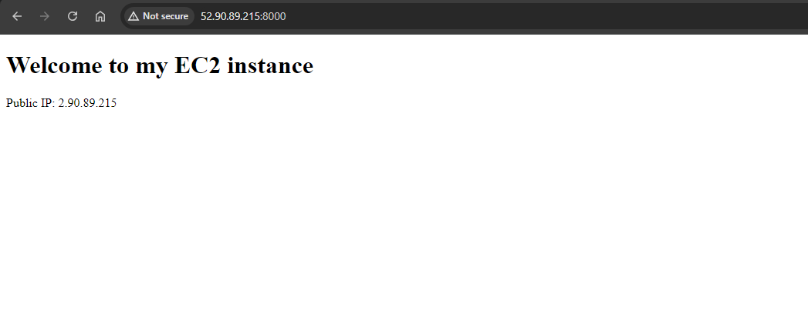
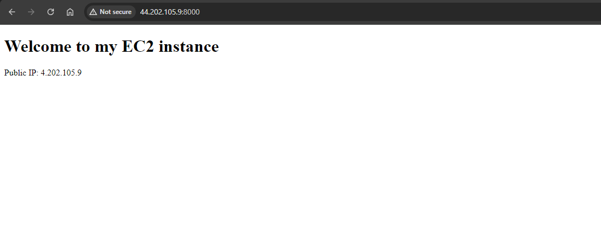

# Automating Loadbalancer Configuration With Shell scripting

## Introduction

This project demonstrates how to automate the setup and maintenance of a load balancer. As DevOps Engineers, automation is at the heart of the work we do. Automation helps us speed up the deployment of services and reduces the rate of errors.
 
### What is Automation?
Automation refers to the practice of using automated tools, processes, and workflows to streamline and accelerate the development, deployment, and operations of software applications. Automation plays a central role in DevOps practices, enabling teams to achieve faster delivery cycles, higher quality, and greater efficiency throughout the software development lifecycle.

### Importance of Automation
**Speed and Efficiency**: 
Automation eliminates manual intervention in the CI/CD process, enabling rapid execution of tasks such as building, testing, and deploying software changes. Automated processes can run concurrently, in parallel, or sequentially, allowing teams to achieve faster delivery cycles and shorter time-to-market for new features and updates.

**Consistency and Reliability**: 
Automated CI/CD pipelines ensure that software changes are built, tested, and deployed consistently and reliably across different environments. Automation eliminates human errors and inconsistencies in the deployment process, leading to more predictable and stable releases.

**Scalability**: 
Automation enables CI/CD pipelines to scale up or down to handle varying workloads, changes in demand, or increases in development activity. Automated processes can be easily replicated, configured, and orchestrated to accommodate changes in project size, team size, or deployment complexity.

**Quality Assurance**: 
Automation facilitates the execution of comprehensive and repeatable tests as part of the CI/CD pipeline, including unit tests, integration tests, functional tests, performance tests, and security tests. Automated testing helps identify defects, regressions, and quality issues early in the development process, ensuring that software changes meet quality standards before deployment.

## Deploying And Configuring Webservers and Load Balancer

### Provisioning EC2 Instances 

+ Launch 2 EC2 instances and name them **webserver_1** and **webserver_2** (These instances will function as our webservers).

+ Edit inbound rules in security groups and open port 8000 for both webservers to allow traffic from anywhere.

+ Connect the instances to your terminal.


### Automating Webservers Configurartion With Shell Script

+ Open a file in both webservers using `sudo vi install.sh`.

+ Paste the shell script below to configure the webserver.

```
#!/bin/bash

####################################################################################################################
##### This automates the installation and configuring of apache webserver to listen on port 8000
##### Usage: Call the script and pass in the Public_IP of your EC2 instance as the first argument as shown below:
######## ./install_configure_apache.sh 127.0.0.1
####################################################################################################################

set -x # debug mode
set -e # exit the script if there is an error
set -o pipefail # exit the script when there is a pipe failure

PUBLIC_IP=$1

[ -z "${PUBLIC_IP}" ] && echo "Please pass the public IP of your EC2 instance as an argument to the script" && exit 1

sudo apt update -y &&  sudo apt install apache2 -y

sudo systemctl status apache2

if [[ $? -eq 0 ]]; then
    sudo chmod 777 /etc/apache2/ports.conf
    echo "Listen 8000" >> /etc/apache2/ports.conf
    sudo chmod 777 -R /etc/apache2/

    sudo sed -i 's/<VirtualHost \*:80>/<VirtualHost *:8000>/' /etc/apache2/sites-available/000-default.conf

fi
sudo chmod 777 -R /var/www/
echo "<!DOCTYPE html>
        <html>
        <head>
            <title>My EC2 Instance</title>
        </head>
        <body>
            <h1>Welcome to my EC2 instance</h1>
            <p>Public IP: "${PUBLIC_IP}"</p>
        </body>
        </html>" > /var/www/html/index.html

sudo systemctl restart apache2
```

> [!NOTE]
> Make sure to read the instructions in the shell script to know how to use it.


+ To close the file click on the `esc` key, then `shift` + `:wqa!`

+ Change the permissions on the file to make an executable using the command below.
`sudo chmod +x install.sh`

+ Run the shell script using the command 
`./install.sh PUBLIC_IP`.


### Automating Load Balancers Configurartion With Shell Script

+ Launch an EC2 instance and name it **"load balancer"**.

+ Edit inbound rules in security groups and open port 80 to anwhere.

+ Connect to the instance using **ssh**.


+ On your terminal, open a file using the command below.
`sudo vi nginx.sh`

+ Paste the shell script below to configure the load balancer.

```
#!/bin/bash

######################################################################################################################
##### This automates the configuration of Nginx to act as a load balancer
##### Usage: The script is called with 3 command line arguments. The public IP of the EC2 instance where Nginx is installed
##### the webserver urls for which the load balancer distributes traffic. An example of how to call the script is shown below:
##### ./configure_nginx_loadbalancer.sh PUBLIC_IP Webserver-1 Webserver-2
#####  ./configure_nginx_loadbalancer.sh 127.0.0.1 192.2.4.6:8000  192.32.5.8:8000
############################################################################################################# 

PUBLIC_IP=$1
firstWebserver=$2
secondWebserver=$3

[ -z "${PUBLIC_IP}" ] && echo "Please pass the Public IP of your EC2 instance as the argument to the script" && exit 1

[ -z "${firstWebserver}" ] && echo "Please pass the Public IP together with its port number in this format: 127.0.0.1:8000 as the second argument to the script" && exit 1

[ -z "${secondWebserver}" ] && echo "Please pass the Public IP together with its port number in this format: 127.0.0.1:8000 as the third argument to the script" && exit 1

set -x # debug mode
set -e # exit the script if there is an error
set -o pipefail # exit the script when there is a pipe failure


sudo apt update -y && sudo apt install nginx -y
sudo systemctl status nginx

if [[ $? -eq 0 ]]; then
    sudo touch /etc/nginx/conf.d/loadbalancer.conf

    sudo chmod 777 /etc/nginx/conf.d/loadbalancer.conf
    sudo chmod 777 -R /etc/nginx/

    
    echo " upstream backend_servers {

            # your are to replace the public IP and Port to that of your webservers
            server  "${firstWebserver}"; # public IP and port for webserser 1
            server "${secondWebserver}"; # public IP and port for webserver 2

            }

           server {
            listen 80;
            server_name "${PUBLIC_IP}";

            location / {
                proxy_pass http://backend_servers;   
            }
    } " > /etc/nginx/conf.d/loadbalancer.conf
fi

sudo nginx -t

sudo systemctl restart nginx
```

> [!NOTE]
> Make sure to read the instructions in the shell script to know how to use it.


+ To close the file click on the `esc` key, then `shift` + `:wqa!`

+ Change the permissions on the file to make an executable using the command below.
`sudo chmod +x nginx.sh`

+ Run the shell script using the command 
`./nginx.sh PUBLIC_IP Webserver-1 Webserver-2`

### Verifying the Setup






